# Device Test Log — Onboarding, Providers & Agents (2026-09-11)

> Perangkat: Infinix X6873 (Android 16, SDK 36, arm64) via ADB.
> Build: `app-online-debug.apk` v1.0.3 (playBuild, targetSdk 36).
> Semua screenshot asli dari HP, di `docs/screenshots/`.

## 1. Onboarding Step 1 — izin & pilih agent

| Permissions | Agent picker |
|---|---|
| 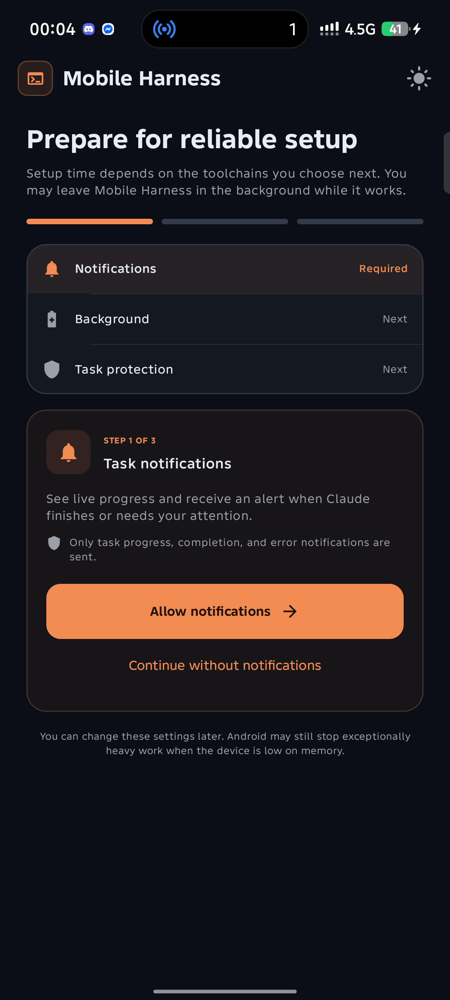 | 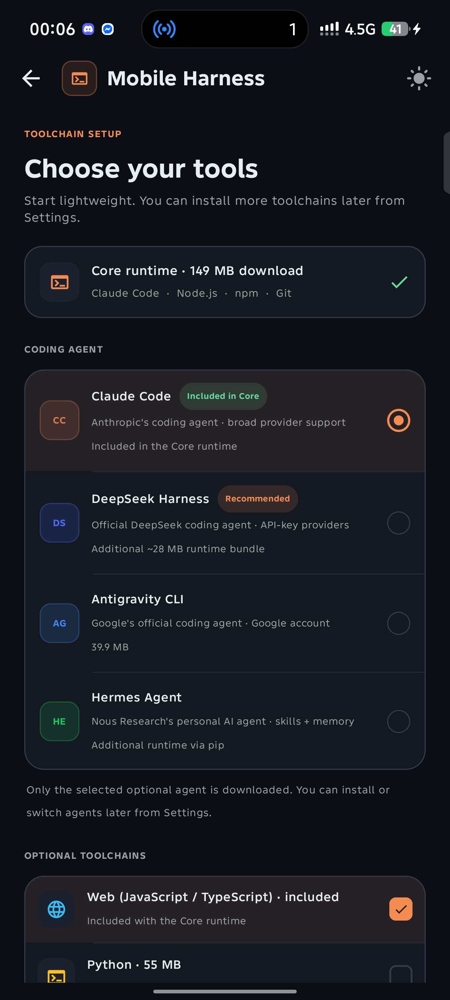 |

- Izin berlapis (Notifications → Background → Task protection) lolos.
- Badge **"Included in Core"** tampil di Claude Code; DeepSeek "Recommended".

## 2. Onboarding Step 2 — daftar provider Hermes

| Provider list | Custom API form |
|---|---|
| 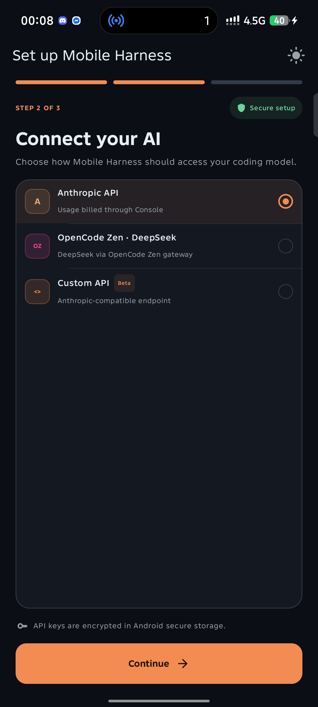 | 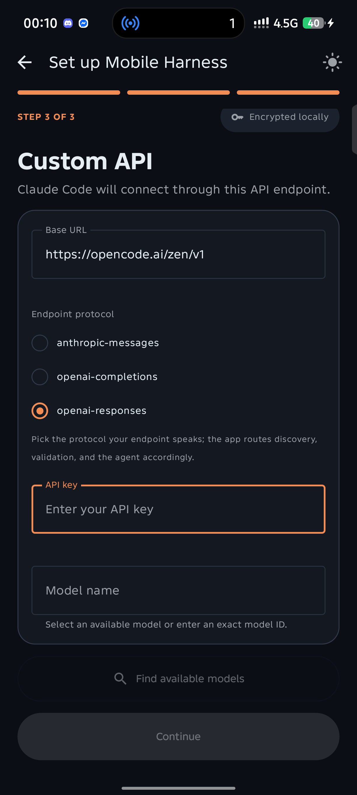 |

- Daftar Hermes = Anthropic API / OpenCode Zen / Custom API.
- 9router, AgentRouter, dan preset localhost HILANG sesuai keputusan.

## 3. Discovery model Zen — 14 model tampil

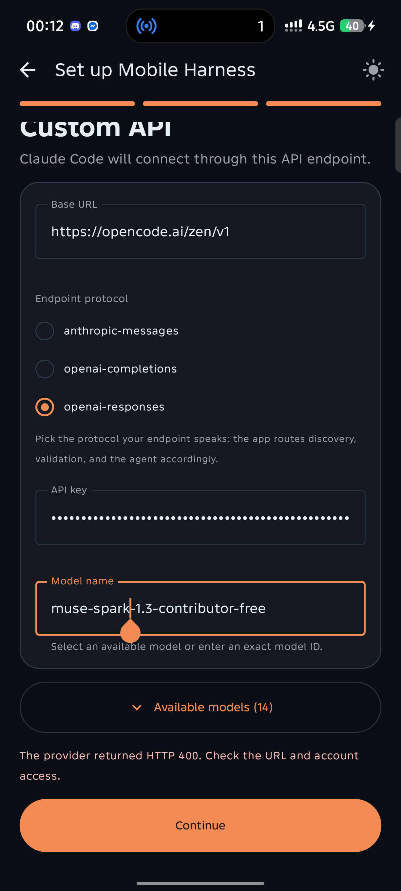

- `https://opencode.ai/zen/v1` + protokol `openai-responses`:
  discovery mengembalikan 14 model, `muse-spark-1.3-contributor-free` terpilih.

## 4. Validasi free-tier — ditolak kebijakan Zen (bukan bug)

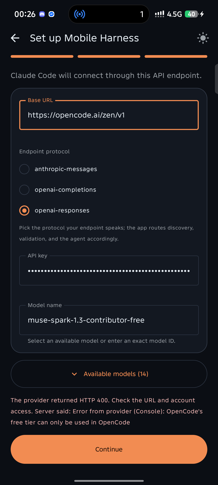

- HTTP 400: *"Error from provider (Console): OpenCode's free tier
  can only be used in OpenCode"*.
- Model free-tier dikunci untuk aplikasi OpenCode sendiri.

## 5. Validasi endpoint Go — butuh header sesi (sudah diperbaiki)

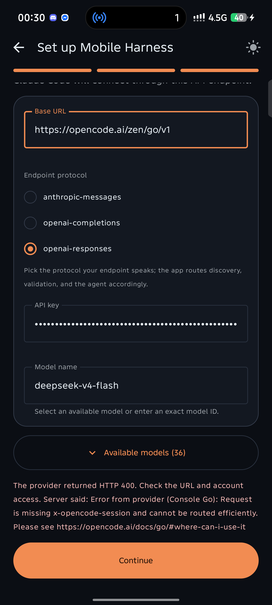

- HTTP 400: *"Request is missing x-opencode-session …"*.
- Fix: header `x-opencode-session` (UUID stabil per install) → validasi
  `deepseek-v4-flash` via `/zen/go/v1` LOLOS, onboarding selesai penuh.

## 6. Chat Hermes pra-rewrite — stuck hening (akar ditemukan)

| Thinking… | …tetap Think |
|---|---|
| 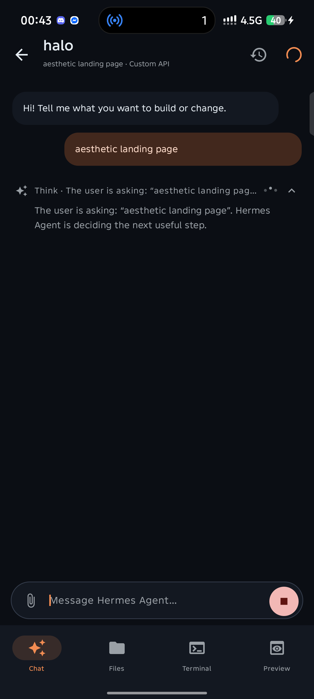 | 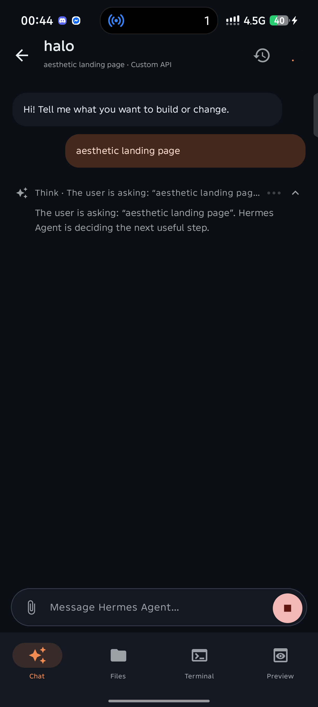 |

- Akar: bridge memakai `ProcessBuilder` Android (selalu gagal) lalu
  me-return null — request tidak pernah dikirim, error tidak pernah tampil.
- Rewrite (`ef105de`): spawn proot nyata, flag CLI asli
  (`hermes chat -q -Q -m MODEL --provider NAME`), gagal dengan pesan.

## 7. Antigravity — hijau end-to-end

| Settings: DeepSeek aktif | Agent bekerja nyata |
|---|---|
| 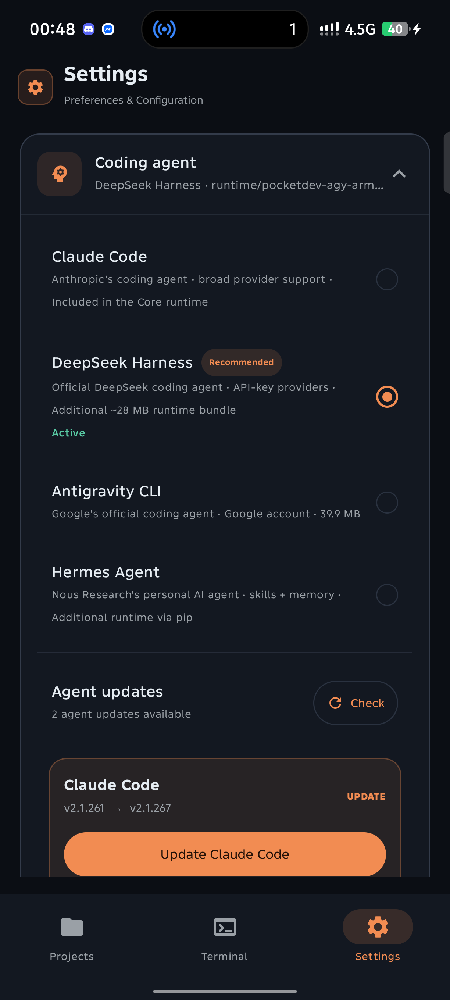 | 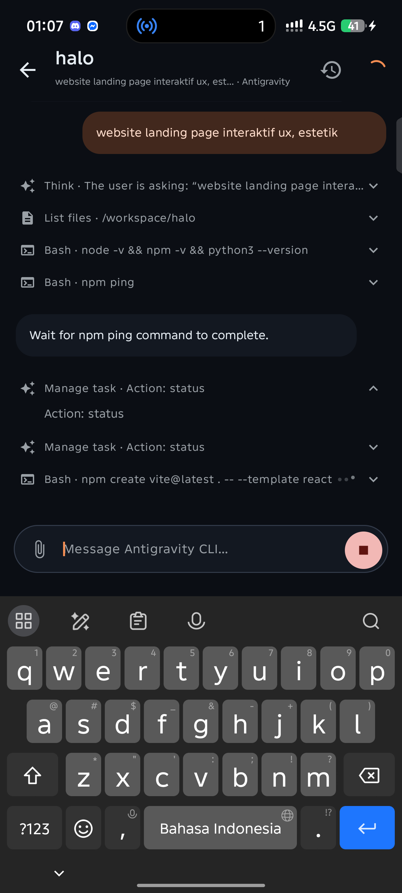 |

- Install via fallback unduhan (42 MB dari upstream) BERHASIL.
- OAuth Google selesai; loop agent nyata: Think → List files →
  Bash → `npm create vite@latest` react.
